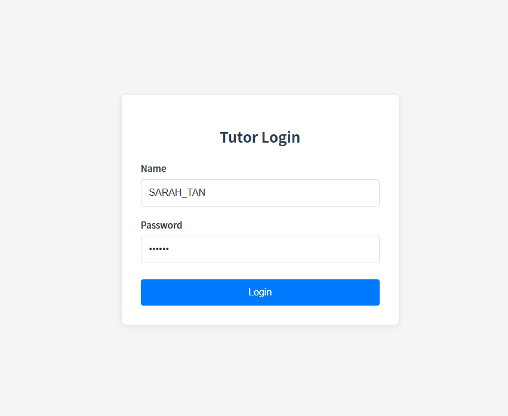
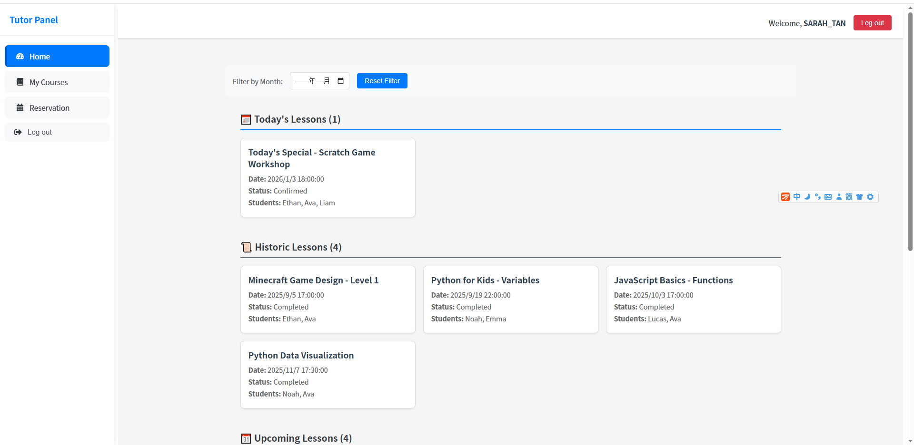
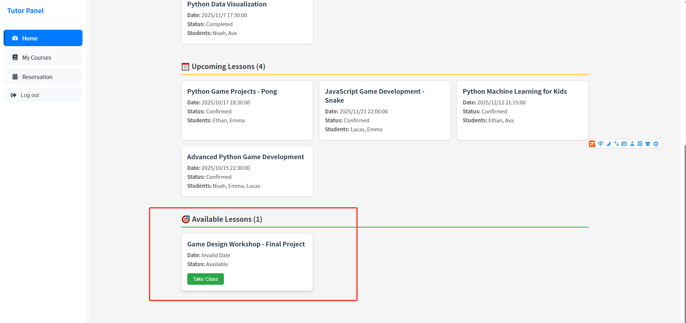

## 🎯Overview

The tutor-end course management system is a lightweight course filtering and management tool specifically designed for mentors

## 🌟 **Key Features**

- **Course Filtering**: Supports dual filtering by **month** and **course status** (Scheduled / Completed)
- **Responsive Design**: Optimized for desktop and tablet devices with a clean, user-friendly layout
- **Mock Data & API Switching**: Built-in mock data support with seamless transition to real backend APIs
- **State Management**: Lightweight, high-performance state management implemented with Zustand

## 🛠 **Tech Stack**

- **Frontend Framework**: React 18 (TypeScript)
- **Build Tool**: Vite
- **State Management**: Zustand
- **HTTP Client**: Axios (with a unified request instance wrapper)
- **Styling Solution**: CSS Modules (style isolation)
- **Code Hosting**: GitHub

## 📦 **Quick Start**

**Prerequisites**

- Node.js ≥ 16.0.0
- npm 

## 📁 Main Structure

```plaintext
src/
├── pages/               # Component directory
│   ├── Dashboard.tsx    # Core dashboard component (course filtering + list)
│   └── Dashboard.module.css  # Dashboard component styles
├── stores/              # State management directory
│   └── tutorPortalStore.ts # Course and filtering state management
├── styles/              # Styles directory
│   └── GlobalStyles.module.css # Global styles
├── types/               # Type definition directory
│   └── Lesson.ts        # Lesson type definition
├── http.ts              # Axios instance encapsulation
├── mock/                # Mock data
└── main.tsx             # Project entry file
```

## ⚙️Running Demo







